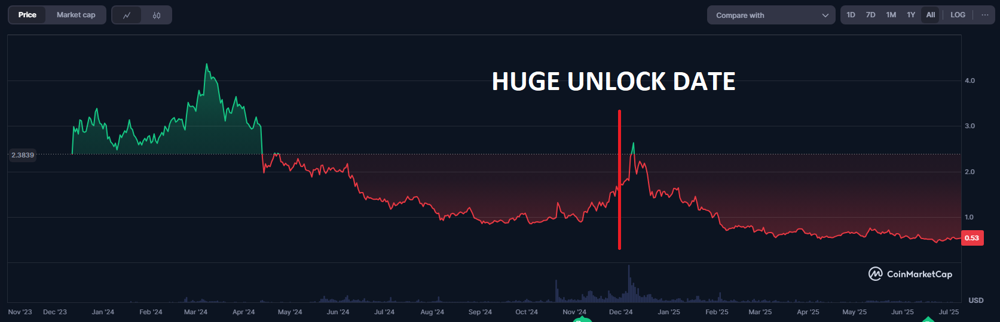
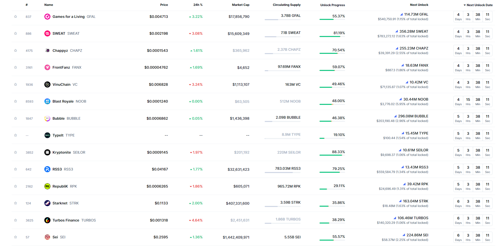
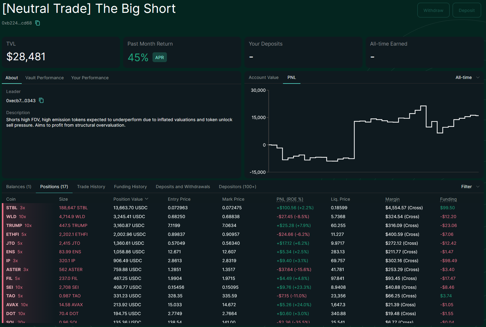

# 📉 \[Hyperliquid] The Big Short


**⚠️ Deprecated vault — historical reference only.**

This vault has been deprecated and is no longer active on Neutral Trade. It is not accepting deposits and is not part of the current product line-up. Do not present this strategy as available or current. For live vaults and current data, see the active strategies and the API reference at https://www.neutral.trade/api/v1/docs.


Everyone talks about token unlocks — but only a few know how to trade them correctly.

We built a strategy that shorts overvalued tokens that are likely to drop when unlock pressure hits. 


Use the Neutral Trade referral link when signing up on Hyperliquid to get LOWER TRADING FEES and unlock FUTURE PERKS:

[https://app.hyperliquid.xyz/join/NEUTRALTRADE](https://app.hyperliquid.xyz/join/NEUTRALTRADE)


***

<figure><figcaption></figcaption></figure>

## Strategy Description

Every day, **millions of tokens are unlocked**. In an illiquid market, that’s forced selling. We track these unlocks and identify when **$500K+ USD in tokens are to hit** the market.

With this information, we find short candidates.

<figure><figcaption></figcaption></figure>

<figure><figcaption></figcaption></figure>

## Strategy Design

### Inflation Coefficient (IC)

$$
IC = Unlock Amount / Market Cap
$$

* This formula tells us which token will most likely lose value.
* **Higher IC → higher pressure → better short candidate.**

### Weight Assignment

* Each token’s short weight is **based on its IC**.
* **Higher inflation → higher short weight.**
* The portfolio **constantly adjusts** as fresh data arrives.

### Rebalancing Logic

Every hour, the algorithm checks **current positions** and **target weights**:

* **If any gap > $20**&#x20;
  * Rebalance

Every day, when **new capital enters**:

* **If deposit > $5 K**
  * Add proportionally to short positions, respecting current weights.

## Why Hyperliquid Vaults?

* Native way to run automated on-chain strategies **without managing bots or infra**.
* **Trust-minimized**, gasless for users.
* Executes on Hyperliquid’s order book for fast, efficient execution at scale.

<figure><figcaption></figcaption></figure>

## Deposit Here:

> #### [https://app.hyperliquid.xyz/vaults/0xb2246d6f3ddeeca74cfd29dc3cce05c1746fcd68](https://app.hyperliquid.xyz/vaults/0xb2246d6f3ddeeca74cfd29dc3cce05c1746fcd68)

***

Launch date - 9th June 25'
