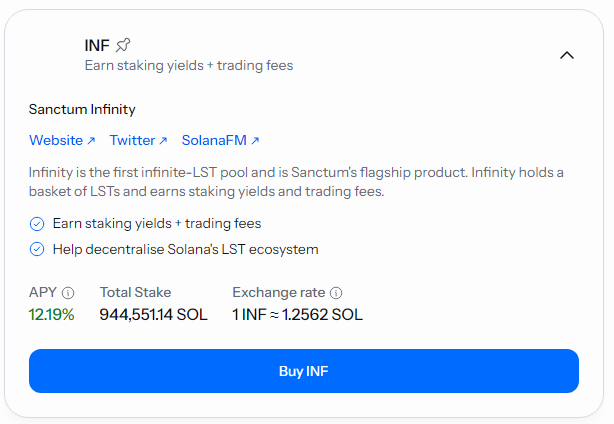

# 🏎️ Drift Funding Arb (USDC) - \[Deprecated]


**⚠️ Deprecated vault — historical reference only.**

This vault has been deprecated and is no longer active on Neutral Trade. It is not accepting deposits and is not part of the current product line-up. Do not present this strategy as available or current. For live vaults and current data, see the active strategies and the API reference at https://www.neutral.trade/api/v1/docs.


<figure><figcaption></figcaption></figure>

Unlock consistent yield with the Drift Funding Arb vault, offering 7.98% APY on your USDC.


Video Explanation:

[https://www.youtube.com/watch?v=bLGQ1Ba0614](https://www.youtube.com/watch?v=bLGQ1Ba0614)


## Explanation of the strategy

Basis trading is a trading strategy used in financial markets, particularly with commodities, futures, or other derivatives. The idea is to take advantage of the price difference between the current price of an asset (called the spot price) and its future price (called the futures price).

The strategy arbitrage **Sanctum Infinity ($INF),** loops it and dynamically hedges by shorting SOL-PERP on Drift.

## Where does the yield come from?

**The USDC Basis Vault** capitalizes on arbitrage opportunities from **$INF** yields from SOL LSTs staking (looped), trading fees, and funding fees from SOL-PERP on Drift.

1. **INF staking (looped 2x), earning Solana’s inflation rewards, priority fees, and MEV opportunities — 20,43% APY as of 11/26/2024**&#x20;
2. **Funding fees — 61.12% APY for SOL-PERP as of 11/26/2024**&#x20;

## What is Sanctum Infinity ($INF) token?

Sanctum Infinity ($INF) is a curated basket of SOL-staked LSTs, designed to grow in value over time. Simply holding INF lets you earn passive profits, fueled by aggregated SOL staking yields, MEV opportunities and trading fees.


[https://sanctum.so/](https://sanctum.so/)


<figure><figcaption></figcaption></figure>

## Fees & Withdrawals

25% performance fee on profits our trading made for you. To optimize liquidity and returns, deposits come with a brief 1-day redemption period.

## Risks

Since we're buying INF with SOL, there's no liquidation risk under normal circumstances. Liquidation is only possible if the borrowing rate for SOL exceeds the INF yield. However, our strategy is designed to automatically unwind the INF loop if this condition arises.

Here’s how the strategy adapts:

* _Positive funding:_ Focuses on basis trading and $INF loops.
* _Positive funding, but high SOL borrowing rate:_ Switches to basis trading alone.
* _Negative funding for 5+ days:_ The strategy continues $INF loops and reverse the basis positions.
* _Negative funding, but high SOL borrowing rate:_ Switches to basis trading alone.
* _Both conditions unfavorable:_ The strategy holds USDC.

This dynamic approach ensures the strategy remains efficient and avoids unnecessary risks.

## Check Trades Here (Drift)


[https://app.drift.trade/?authority=CxL8eQmGhN9LKSoHj7bU95JekFPtyZoUc57mbehb5A56](https://app.drift.trade/?authority=CxL8eQmGhN9LKSoHj7bU95JekFPtyZoUc57mbehb5A56)


## Deposit Links:

Neutral Trade Website (Main):


[https://www.app.neutral.trade/strategies/solbasisinf](https://www.app.neutral.trade/strategies/solbasisinf)


Drift Website (Backup):


[https://app.drift.trade/vaults/strategy-vaults/CxL8eQmGhN9LKSoHj7bU95JekFPtyZoUc57mbehb5A56](https://app.drift.trade/vaults/strategy-vaults/CxL8eQmGhN9LKSoHj7bU95JekFPtyZoUc57mbehb5A56)


***

USDC Basis launch date - 28 Nov.

