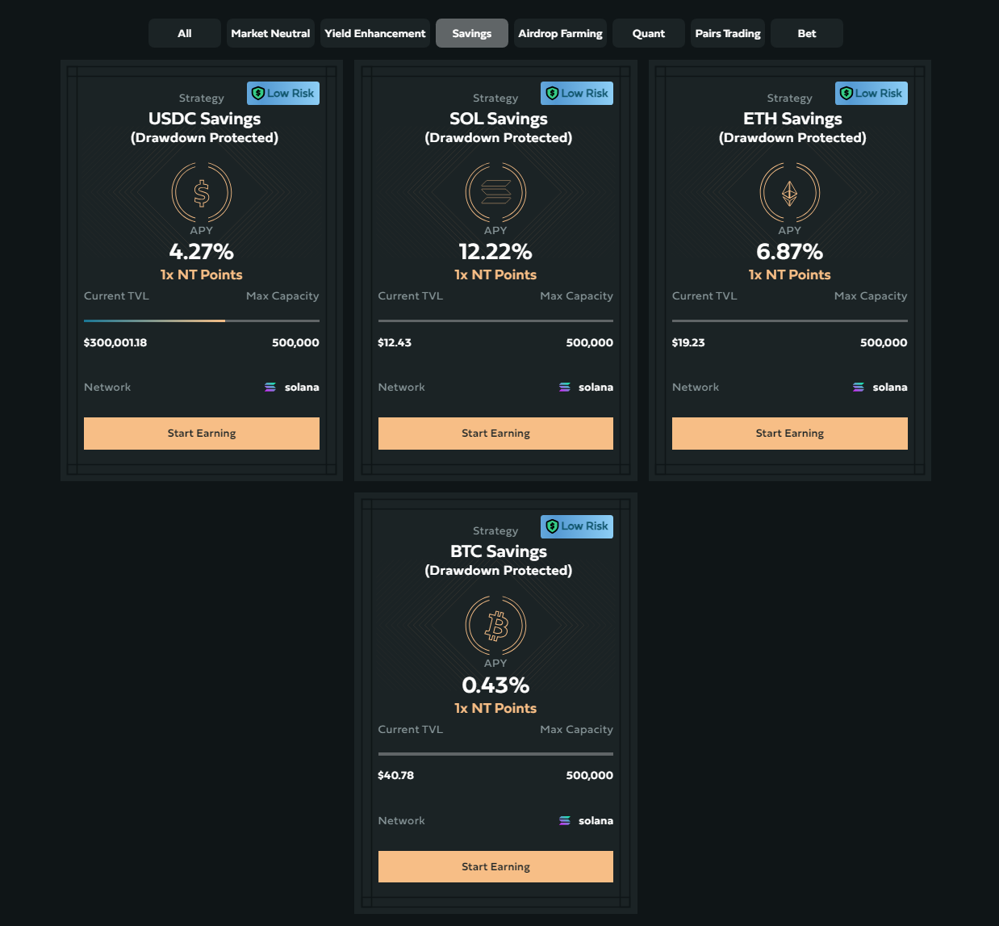

# 🛡️ USDC/SOL/BTC/ETH Savings \[Deprecated]


**⚠️ Deprecated vault — historical reference only.**

This vault has been deprecated and is no longer active on Neutral Trade. It is not accepting deposits and is not part of the current product line-up. Do not present this strategy as available or current. For live vaults and current data, see the active strategies and the API reference at https://www.neutral.trade/api/v1/docs.


<figure><figcaption></figcaption></figure>

## Explanation of Savings

Savings Vaults earn yield from Drift traders, including Neutral Trade’s strategies. Your assets are borrowed for a fee that changes, so the APY varies too.&#x20;

The best way to earn yield on **blue-chip assets** — perfect for those seeking **stable, low-risk returns**.

<figure><figcaption></figcaption></figure>

Deposit USDC, SOL, ETH, or BTC into our Savings Vaults and lock in yield.

The new Savings tab is live on our site. Current Rates (2025/03/11):

* USDC: 4.27% APY
* SOL: 12.22% APY
* ETH: 6.87% APY
* BTC: 0.43% APY

Earn stable yields and stack NT Points on top.

## Redemption Period

Savings vaults feature no withdrawal redemption period, allowing funds to be accessed and withdrawn immediately.

## Risks

While savings are considered low-risk and drawdown protected, certain risks remain, primarily stemming from counterparty exposure on Drift’s decentralized exchange (DEX). The key risk lies in Drift’s overall financial stability. If the exchange faces solvency issues, funds stored in its accounts may be at risk.

***

Launch date: 2025-03-11&#x20;
