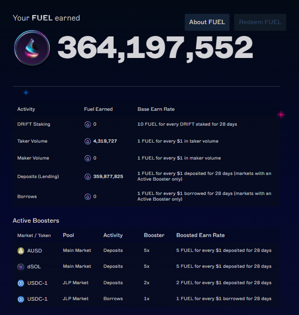
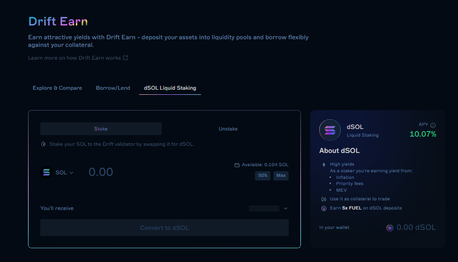
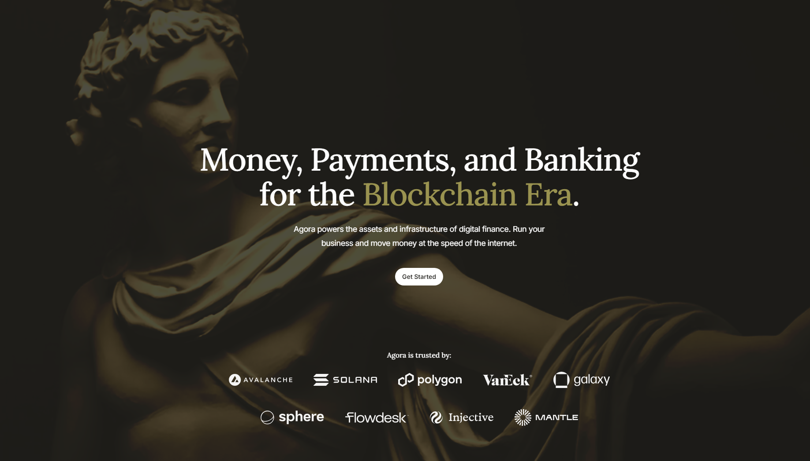

# ⛽ Fuel MAXI - \[Deprecated]


**⚠️ Deprecated vault — historical reference only.**

This vault has been deprecated and is no longer active on Neutral Trade. It is not accepting deposits and is not part of the current product line-up. Do not present this strategy as available or current. For live vaults and current data, see the active strategies and the API reference at https://www.neutral.trade/api/v1/docs.


<figure><figcaption></figcaption></figure>

Do you think Drift’s FUEL drop will be significant? Up to 7.82% of total DRIFT supply allocated this season! Need more FUEL?&#x20;

Deposit USDC and let us provide you a boost, \~7.5x more FUEL! This vault is for those looking for maximized Drift FUEL rewards, all while your USDC position remains hedged.

## How does it work:

<figure><figcaption></figcaption></figure>

First, deposit USDC in the vault. The USDC is then swapped to AUSD on Jupiter, earning a 5x FUEL multiplier.

AUSD is collateralized on Drift, earning lending yield. SOL is then borrowed and swapped into dSOL, earning a 5x FUEL multiplier too while dSOL staking yield and AUSD lending yield cover the SOL borrowing.

This strategy's position of both AUSD & dSOL, strategically leveraged through Drift’s borrow & lending market, provides \~7.5x the FUEL rewards boost for every $1 of USDC you deposit!&#x20;

> https://docs.drift.trade/fuel/overview

## What is dSOL?

<figure><figcaption></figcaption></figure>

dSOL (Drift SOL) is a liquid staked Solana (LST) on Drift DEX. If you’re familiar with JitoSOL, think of dSOL as its direct counterpart, but designed specifically by Drift DEX.

## What is AUSD?

<figure><figcaption></figcaption></figure>

AUSD is a digital dollar minted 1:1 with USD fiat. It’s designed to be a secure digital currency, utilizing one of the world’s largest custodian banks to secure assets, a big 4 auditor and a top tier fund manager.

> [https://www.agora.finance/](https://www.agora.finance/)

## Fees & Withdrawals

20% commission on profits our trading made for you. To optimize liquidity and returns, withdrawals are subject to a brief 1-day redemption period.

A 1-day withdrawal redemption period applies.

## Check Trades Here (Drift)


[https://app.drift.trade/?authority=DzaHA2zD7XQhj2Z6tG9YxVtgcvJ4sqzeLYr8dszyQTEq](https://app.drift.trade/?authority=DzaHA2zD7XQhj2Z6tG9YxVtgcvJ4sqzeLYr8dszyQTEq)


## Deposit Links:

Neutral Trade Website (Main):


[https://www.legacy.neutral.trade/strategies/fuel-maxi](https://www.legacy.neutral.trade/strategies/fuel-maxi)


Drift Website (Backup):


[https://app.drift.trade/vaults/strategy-vaults/DzaHA2zD7XQhj2Z6tG9YxVtgcvJ4sqzeLYr8dszyQTEq](https://app.drift.trade/vaults/strategy-vaults/DzaHA2zD7XQhj2Z6tG9YxVtgcvJ4sqzeLYr8dszyQTEq)


***

Fuel MAXI launch date - 28 Feb.
