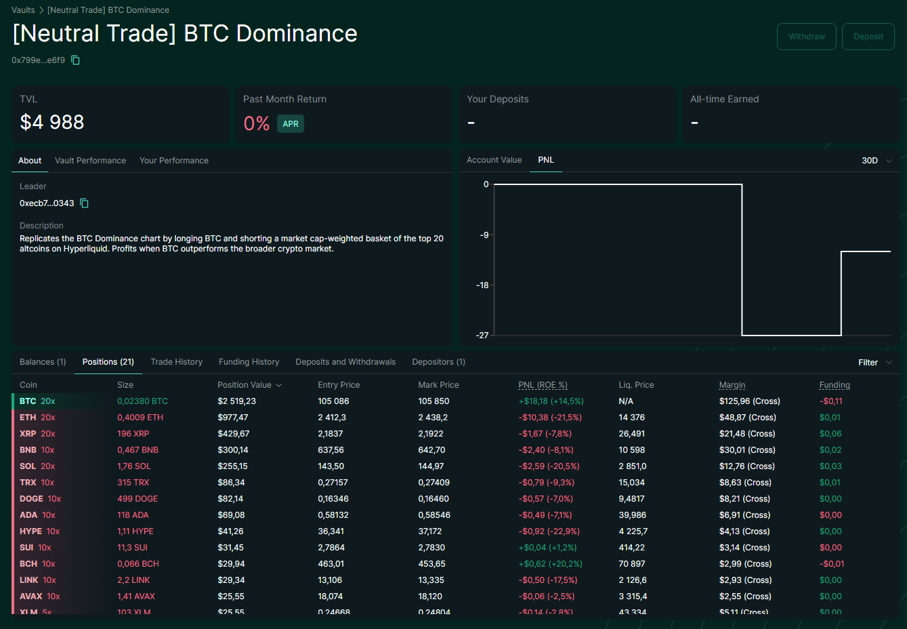
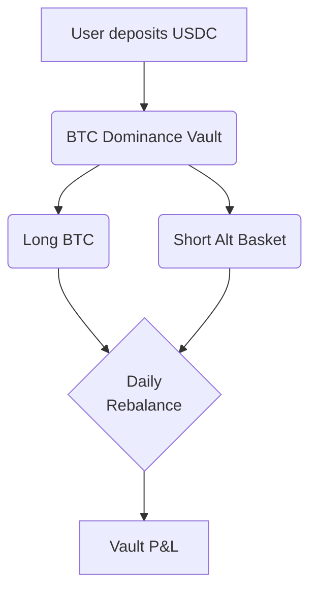
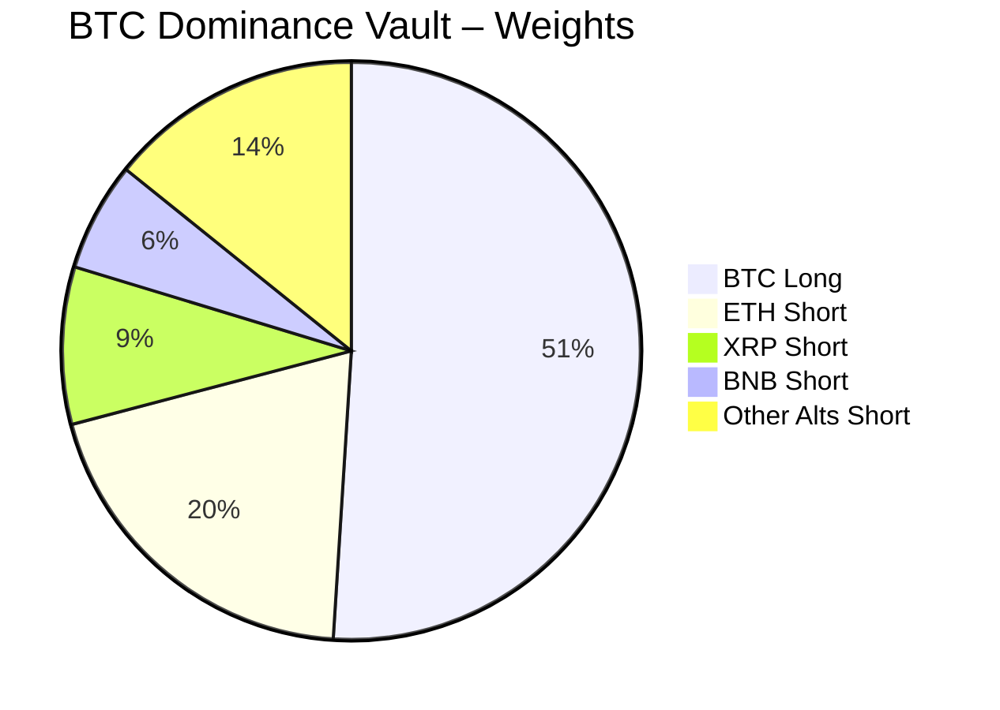

# \[Hyperliquid] BTC Dominance \[Deprecated]


**⚠️ Deprecated vault — historical reference only.**

This vault has been deprecated and is no longer active on Neutral Trade. It is not accepting deposits and is not part of the current product line-up. Do not present this strategy as available or current. For live vaults and current data, see the active strategies and the API reference at https://www.neutral.trade/api/v1/docs.


<figure><figcaption></figcaption></figure>

Neutral Trade is now live on Hyperliquid — starting with our [Funding Arb](../../for-capital-allocators/market-neutral/hyperliquid-funding-arb.md) strategy and expanding with two brand-new Dominance Vaults, built directly on Hyperliquid’s native vault infrastructure.


Save more on Hyperliquid! Use our Referral Code:

[https://app.hyperliquid.xyz/join/NEUTRALTRADE](https://app.hyperliquid.xyz/join/NEUTRALTRADE)


<figure><figcaption></figcaption></figure>

## 🤔 What is Dominance?

Dominance shows how much of the total crypto market is allocated to a specific asset — **BTC** or **Altcoins.**

### ➗Formulas:

$$
\text{Dominance}_{BTC} = \frac{\text{Market Cap}_{BTC}}{\sum_{i=1}^{N} \text{Market Cap}_i}
$$

This ratio reflects capital flows:

* **BTC Dominance ↑** → Capital is rotating into Bitcoin (risk-off)
* **BTC Dominance ↓** → Capital is rotating into altcoins (risk-on)

**ALT Dominance** is simply the inverse:

$$
\text{Dominance}_{ALT} = 1 - \text{Dominance}_{BTC}
$$

***

## 1. BTC Dominance Vault

<figure><figcaption></figcaption></figure>

This vault captures **Bitcoin strength relative to altcoins**.

It goes:

* **Long BTC**
* **Short a diversified altcoin basket on Hyperliquid**

You profit when Bitcoin **outperforms** alts — even in flat or declining markets (You are market-neutral)

### 1.1 Mechanics and features

* **1x notional exposure** — fully collateralized, no leverage
* **Daily rebalancing** using float-adjusted market caps
* Automated algorithms (No manual rebalancing)

### 1.2 BTC Dominance Vault Flow

### 1.3 Live Allocation (The latest snapshot)

| Asset            | Direction | % of Vault AUM |
| ---------------- | --------- | -------------- |
| **BTC**          | Long      | 51%            |
| ETH              | Short     | 19.9%          |
| XRP              | Short     | 8.8%           |
| BNB              | Short     | 6.1%           |
| SOL              | Short     | 5.2%           |
| _Rest of top-20_ | Short     | 8.0%           |

### 1.4 Weights Visualization (The latest snapshot)

***

## How You Make Money

Crypto doesn’t just move up or down — it **ROTATES**

Sometimes Bitcoin leads. Sometimes altcoins run. That back-and-forth creates one of the most reliable patterns in the market — and **Dominance Vaults** are built to capture it

### Here's how you benefit:

#### 1. **Profit from Capital Rotation**

Markets frequently rotate between **risk-on** (focused on altcoins) and **risk-off** (focused on Bitcoin) phases, representing two flip sides.

You make money when one side **outperforms** the other, even if overall prices stay flat.

<figure><figcaption></figcaption></figure>

#### 2. Risk-controlled investment

The vaults spread your position across a carefully selected basket of assets — including L1s, DeFi, memes, and majors — to reduce the impact of any single token blowing up or underperforming

### TLDR:

* **BTC Dominance Vault** → Long BTC / Short Alts → Works best during BTC rallies or corrections
* **ALT Dominance Vault** → Long Alts / Short BTC → Works best during altcoin season
* 100% market-neutral, daily-rebalanced and auto-optimized
* Easy to use

***

## Fees & Withdrawals

10% commission on profits our trading made for you.

***

## Deposit Links:

Neutral Trade website:


[https://www.app.neutral.trade/strategies/](https://www.app.neutral.trade/strategies/hyperjlp)


Hyperliquid directly:

> BTC Dominance Vault: [https://app.hyperliquid.xyz/vaults/0x799e0112977c37f8d93a768cf5a2305bdd3ae6f9](https://app.hyperliquid.xyz/vaults/0x799e0112977c37f8d93a768cf5a2305bdd3ae6f9)

## Check Positions Here (Hyperliquid)


BTC Dominance Vault: [https://app.hyperliquid.xyz/vaults/0x799e0112977c37f8d93a768cf5a2305bdd3ae6f9](https://app.hyperliquid.xyz/vaults/0x799e0112977c37f8d93a768cf5a2305bdd3ae6f9)


***

### Launch date - 25th June 25'
