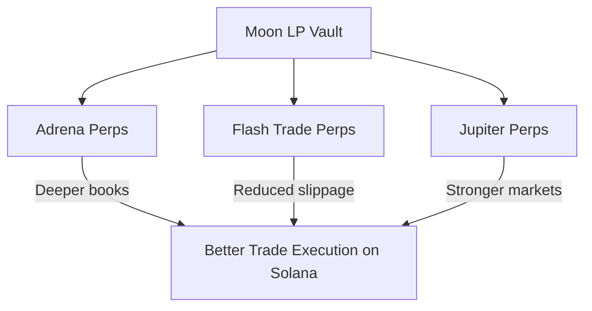
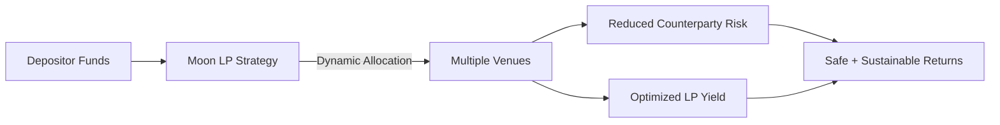
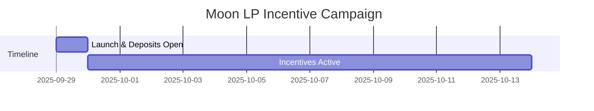

# 🌝 Moon LP

### Introduction

The Solana perp ecosystem is expanding rapidly, but liquidity fragmentation remains one of the biggest barriers to sustainable growth. Individual venues compete for deposits, creating shallow markets and inconsistent execution.

Moon LP solves this by acting as a cross-venue liquidity engine, automatically allocating capital across Adrena, Flash Trade, and Jupiter. This not only improves LP returns but also strengthens the overall health of Solana’s perpetual futures markets.

***

<figure><figcaption></figcaption></figure>

### Why Moon LP Matters for the Solana Ecosystem

* **Unified Liquidity Across DEXes:** Instead of competing for isolated pools, Moon LP brings capital into a single strategy that feeds multiple perp markets at once. This creates deeper orderbooks, better trade execution, and reduces slippage for traders across Solana.
* **Resilient Market Structure:** By dynamically rebalancing liquidity, Moon LP helps avoid the fragility of over-concentration on one venue. A healthier distribution of capital = less systemic risk.
* **Ecosystem Alignment:** Moon LP is jointly incentivized with Flash Trade and Adrena, aligning stakeholders to grow the entire perp market rather than just individual platforms.

***

### Why Moon LP is Good for Depositors

For LPs, the value proposition is clear:

1. **Diversified Exposure = Reduced Counterparty Risk:** Traditional LPing concentrates deposits into one venue, leaving users exposed if that DEX underperforms or faces operational risk. Moon LP spreads deposits dynamically, lowering the chance of adverse outcomes from any single venue.
2. **Optimized Yield Through Dynamic Allocation:** Instead of chasing yield manually, Moon LP automatically allocates where utilization is highest. This ensures LPs capture the best available returns in real time without active management.
3. **Passive Strategy, Professional Execution:** Depositors don’t need to monitor spreads, rebalance, or shift liquidity between venues. Moon LP handles the execution with a professional-grade algorithm.
4. **Short-Term Boost With Incentives:** Early adopters gain access to **$2,000 in $ADX** and **$2,000 in $FAF** rewards distributed over 2 weeks, further amplifying initial yield.

***

### Incentive Program

* **Total Incentives:** $2,000 in $ADX and $2,000 in $FAF
* **Duration:** 2 weeks (from launch)
* **Distribution:** Pro-rata based on user deposits

This incentive program is designed as a short-term catalyst — seeding initial TVL, attracting depositors, and providing valuable data to evaluate long-term sustainability.

***

### Benefits

* **For Solana Perps:** Deeper liquidity, tighter spreads, and healthier markets.
* **For Adrena & Partners:** Coordinated incentives highlight collaboration, not competition.
* **For Depositors:** Safer, smarter, and more profitable LPing.

Moon LP represents the next evolution of liquidity provision on Solana: capital-efficient, risk-aware, and ecosystem-aligned.

***

### Launch date - 29th September 25'
