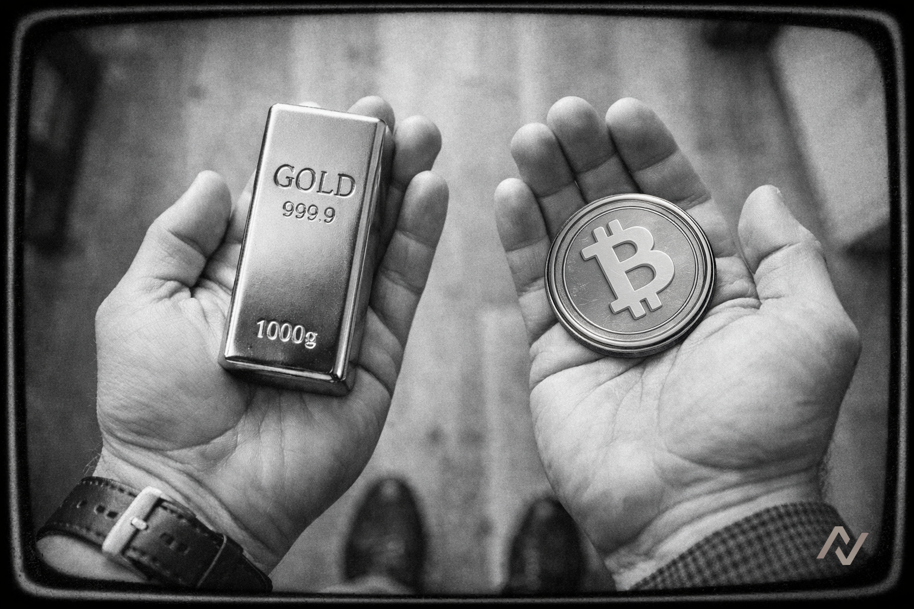

# 🗝️ The Great Debasement


**⚠️ Deprecated vault — historical reference only.**

This vault has been deprecated and is no longer active on Neutral Trade. It is not accepting deposits and is not part of the current product line-up. Do not present this strategy as available or current. For live vaults and current data, see the active strategies and the API reference at https://www.neutral.trade/api/v1/docs.


### Dodge Debasement, Deposit Here


[https://www.neutral.trade/strategies/great-debasement](https://www.neutral.trade/strategies/great-debasement)


## Introduction 

<figure><figcaption></figcaption></figure>

In a world of accelerating money printing and persistent inflation, preserving purchasing power has become harder than ever. Fiat currencies steadily lose value, while investors search for assets that can hold their ground over long time horizons.

The Great Debasement Vault is built as a direct response to this reality. It maintains a simple, disciplined structure: 50% exposure to zBTC via [Zeus Network](https://app.zeusnetwork.xyz/mint) and 50% exposure to tokenized gold via [Oro](https://www.oro.finance/).&#x20;

Rebalancing is executed through [Titan Swap](https://titan.exchange/swap), ensuring the vault consistently targets a 50:50 allocation. Trade execution is handled by Neutral Trade’s randomized DCA algorithm, which fragments orders over time to minimize slippage and reduce the risk of front-running. By combining the hardest digital asset with the oldest monetary hedge, the vault offers a modern defence against currency debasement.

## Strategy

<figure><figcaption></figcaption></figure>

* **Balanced Risk Profile:** A 50/50 allocation reduces reliance on any single asset behaving perfectly. If volatility hits crypto markets, gold provides stability; if digital assets outperform, BTC captures that upside.
* **Passive Protection Strategy:** Depositors don’t need to rebalance, time markets, or react to macro headlines. The vault maintains its allocation automatically, removing emotional decision-making.

## Why The Great Debasement Vault Matters 

* **A Hedge for the Modern Monetary Era:** Instead of betting on a single narrative, the vault balances two historically resilient assets. Bitcoin captures the upside of digital scarcity, while gold anchors the portfolio with centuries of debasement hedging reliability.
* **Simplicity Over Speculation:** No leverage, no complex rotations, no chasing. The vault’s design focuses on long-term protection rather than chasing short-term performance.
* **On-Chain, Transparent Exposure:** By using tokenized representations of BTC and gold, the vault delivers traditional store-of-value exposure in an on-chain environment.

## Incentives 

To bootstrap early participation, Zeus Network and Oro will jointly seed $3,000 in incentives for early depositors. These incentives are compounded within the vault, and reflected in the share price.

**Total Incentives:** $3,000\
**Distribution:** Pro-rata based on deposits\
**Target:** Early participants during the initial launch phase

These incentives are designed to reward early conviction while the vault establishes its initial capital base.
