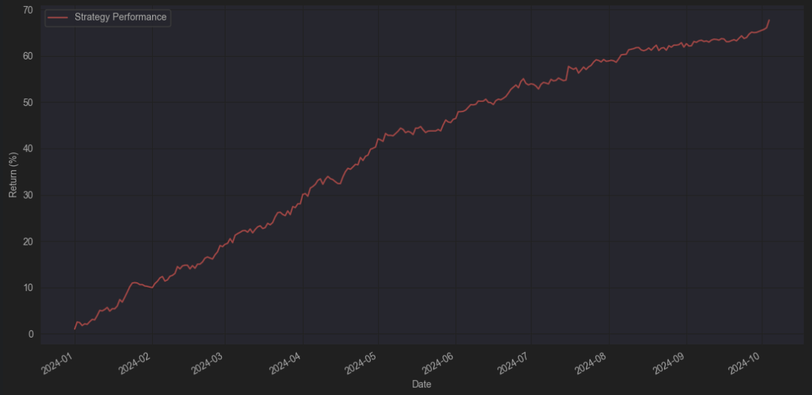

# 🔥 JLP Delta Neutral on Drift - \[Deprecated]


**⚠️ Deprecated vault — historical reference only.**

This vault has been deprecated and is no longer active on Neutral Trade. It is not accepting deposits and is not part of the current product line-up. Do not present this strategy as available or current. For live vaults and current data, see the active strategies and the API reference at https://www.neutral.trade/api/v1/docs.



Video Explanation:

[https://www.youtube.com/watch?v=EbBLCv0jpCA](https://www.youtube.com/watch?v=EbBLCv0jpCA)


## Strategy Description

The JLP Delta-Neutral (JLP DN) Strategy provides a unique way to earn yield using advanced quantitative and systematic methods. This strategy allows users to generate steady yields by collecting fees from Jupiter perpetual traders. And under certain market conditions, it can also boost its yield through funding fees from hedging positions.

<figure><figcaption></figcaption></figure>

## Strategy Design

The JLP Delta Neutral strategy earns yield from JLP (Jupiter Liquidity Provision). This is from traders trading on Jupiter. Through dynamic hedging, JLP's directional exposure is removed.&#x20;

The strategy is monitored 24/7 systematically and dynamically leveraged based on predicted fees with minimum delta exposure.

### Yield Sources:

* JLP
  * Opening/closing fees
  * Borrowing fees
  * Trading fees
  * Price impact
* Funding Rates
  * BTC (If positive)
  * SOL (If positive)
  * ETH (If positive)

### Hedging Targets:

* BTC, SOL, ETH
  * Unutilized volatile assets within JLP
* Active trader positions
  * PnL of Jupiter traders'

### Exposures:

* JLP Yield
* Funding Rates
* Borrow Costs

### Flow:

<figure><figcaption></figcaption></figure>

## Performance

The JLP DN Strategy generated a real yield of over 70% APY for the first 3 months after going live. This came primarily from trading, borrowing, and liquidation fees earned from traders using Jupiter perps.

This strategy offers one of the best risk-adjusted returns in the market and works alongside trusted platforms such as Drift and Jupiter, both known for their strong audits and reliability.

Unlike other yield farming opportunities, the JLP DN Strategy offers a unique and reliable way to earn high returns natively without the need for incentives.

<figure><figcaption></figcaption></figure>

***

## Risks



***

JLPDN launch date - 1 Oct.

JLPDN (Drift) V2 launch date - 12 Nov.&#x20;

JLPDN (Drift) V3 launch date - 23 Dec.

JLPDN (Drift) V4 launch date - 2025-01-23

JLPDN (Drift) V5 launch date - 2025-01-24
