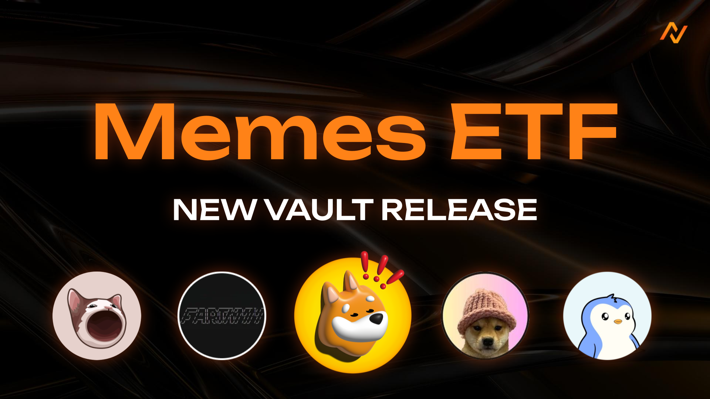

# 🐸 Memes ETF (Generational Wealth) \[Deprecated]


**⚠️ Deprecated vault — historical reference only.**

This vault has been deprecated and is no longer active on Neutral Trade. It is not accepting deposits and is not part of the current product line-up. Do not present this strategy as available or current. For live vaults and current data, see the active strategies and the API reference at https://www.neutral.trade/api/v1/docs.


<figure><figcaption></figcaption></figure>

**The Solana Memes ETF** is a diversified, actively managed index vault built to capture the explosive potential of top-tier Solana memecoins. As community hype and market interest around memecoins grow, this vault gives you structured exposure to a handpicked basket of what we see as the blue chips of the Solana meme world.

Want to bet on memes without doing hours of research? We've got you. The Memes ETF includes the most popular Solana memes, weighted by market cap and optimized for diversification — so you don’t have to overthink it. Just ape in.

**BONK, FART, WIF, PENGU, POPCAT** — and that’s just the beginning. The ETF will keep evolving, adding new meme heavyweights as the ecosystem grows.

## Explanation of the Memes Index Vault

<figure><figcaption></figcaption></figure>

#### Why hold just one memecoin when you can ride the whole wave?

Picking the next big memecoin is a gamble — one might moon, others might flop. That’s why we built **Memes ETF**.

### What Memes ETF does:

* **Diversifies your capital** across top-tier Solana memecoins
* **Curates the best picks** — like BONK, FART, WIF, PENGU, and POPCAT
* **Captures upside efficiently**, based on market cap weightings

### How it works:

You deposit USDC.\
We allocate it across memecoins via spot buys.\
Each meme’s weight (e.g., BONK getting the largest share) reflects its market dominance — all while earning additional lending fees from Drift traders as a small bonus on top.

### Rebalanced for the Meme Meta:

**Memes ETF** isn’t static. As new opportunities arise, our team of quants and pro traders constantly re-evaluates and rebalances — adding high-potential memecoins to keep your exposure optimized.

## Fees & Withdrawals

10% commission on profits our trading made for you. 2% annual service fee (charged by the time period the deposits are in the vault; Daily 0.00548% on your principal).

Withdrawals are subject to a 1-day redemption period.

## Check Trades Here (Drift)


[https://app.drift.trade/?authority=AHfaqTwFhWiX2DZrYbTivBpbrstNJRyjHG4mFPVpJS5n](https://app.drift.trade/?authority=AHfaqTwFhWiX2DZrYbTivBpbrstNJRyjHG4mFPVpJS5n)


## Deposit Links:

Neutral Trade Website (Main):


[https://www.app.neutral.trade/strategies/memesetf](https://www.app.neutral.trade/strategies/memesetf)


***

Memes Index launch date — 14 May 2025
