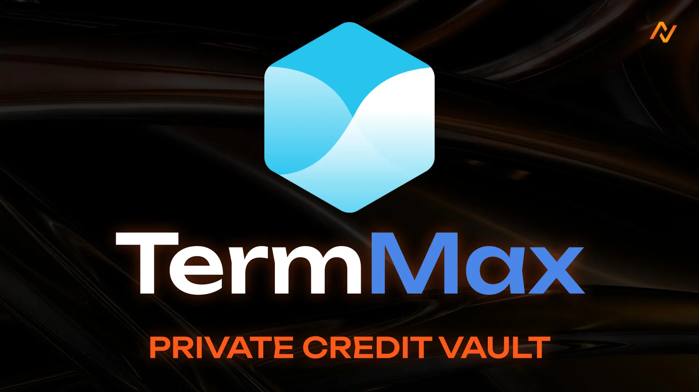

# TermMax (Closed)


**⚠️ Deprecated vault — historical reference only.**

This vault has been deprecated and is no longer active on Neutral Trade. It is not accepting deposits and is not part of the current product line-up. Do not present this strategy as available or current. For live vaults and current data, see the active strategies and the API reference at https://www.neutral.trade/api/v1/docs.


<figure><figcaption></figcaption></figure>

With the **TermMax Private Credit Vault**, you can earn **\~18%–27% APY on USDC** while gaining exposure to the upside of a promising DeFi protocol — all through Neutral Trade’s first private credit product.

### Why This Deal Matters for Stablecoin Holders

Still parking USDC in a lending protocol earning 3–4%? Or worse, letting it sit idle in your wallet?

This vault offers a smarter way to earn:

* **\~18% APY** on your USDC over \~4 months
* **Bonus upside** through $TMX token exposure
* **TGE unlocks before VCs** — you get in earlier
* **Short-term lock** — funds are deployed and returned by **mid-October 2025**

Think of it as VC-style exposure with **lower downside** and **passive returns** — a rare combination in DeFi.

### About TermMax Finance

TermMax is a fixed-rate, fixed-maturity **lending AMM protocol** designed for professional traders and market makers in DeFi.

#### Key Features

* **Custom Rate Curves**: Makers post dynamic lending rates (forward curve style), improving capital efficiency.
* **ERC-4626 Vaults & One-Click Leverage**: Power users can scale positions instantly, while passive users benefit from strategy-managed vaults.

#### Backed by Tier-One Investors

TermMax is built by the team behind [TermStructureFi](https://twitter.com/TermStructureFi), which recently raised **$4.45M** from top funds including:

* @Cumberland
* @HashKey\_Capital
* And other leading DeFi investors

### Deal Structure: Where the Yield Comes From

Here’s how the \~18% APY is constructed:

| Component      | Yield (%) | Details                                                       |
| -------------- | --------- | ------------------------------------------------------------- |
| Base Yield     | \~4%      | From USDC vault on TermMax (variable, daily accrual)          |
| TMX Airdrops   | \~6%      | Daily incentives, unlocked at TGE, no vesting                 |
| Yield Backstop | \~8%      | TermMax tops up any shortfall to reach 18% total APY (in TMX) |

#### Extra Rewards for Larger Depositors

* Additional **6–9% APY** in bonus $TMX for larger allocations
* No cliff, linear vest over 6 months
* Rewards claimed and managed on your behalf
* TGE expected **Q3–Q4 2025**

### Campaign Timeline (Step-by-Step)

1. **Now → Day 7**: Deposit window open
2. **Day 8**: Vault goes live, funds bridged to Ethereum
3. **Month 4**: Capital unlock + unwind phase begins
4. **Post-TGE**: $TMX token rewards distributed in USDC equivalent (pro-rata)

### Timeline Summary

| Phase                 | Timeline                        |
| --------------------- | ------------------------------- |
| Deposit Window        | Now → Day 7                     |
| Vault Activation      | Day 8                           |
| Maturity & Withdrawal | Month 4 (October 2025)          |
| TMX Distribution      | After TGE (Q3–Q4 2025 expected) |

### Risks to Know

* **Smart Contract Risk**: TermMax contracts audited by **Spearbit x Cantina**
* **Yield Variability**: Base APY + token rewards may fluctuate with market conditions
* **TGE Timing**: Target is Q3–Q4 2025, subject to market shifts
* **Withdrawal Timing**: Capital is actively deployed; unwinding may require time and coordination

### TMX Token Valuation (Estimate)

* Target FDV: **$60M**
* Estimated Token Price: **$0.06**
* Vault participants get exposure before VCs unlock

### Performance Fee

We charge a 20% commission on profits earned.

* **No upfront fees**
* **Principal never touched**
* **Fee is calculated on net gain**
* **Deducted automatically at withdrawal**

If you don’t earn, we don’t earn. Incentives are fully aligned.

### Summary

| Feature        | Details                                               |
| -------------- | ----------------------------------------------------- |
| APY            | 18%–27% (USDC + TMX exposure)                         |
| Lockup         | \~4 months                                            |
| Token Exposure | $TMX airdrops + bonus pool                            |
| TGE            | Expected Q3–Q4 2025                                   |
| Risks          | Smart contracts, token price, withdrawal coordination |
| Commission     | 20% on profit only                                    |
