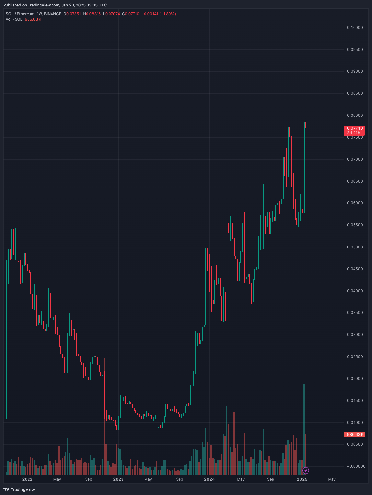

# SOL / ETH Flip \[Deprecated]


**⚠️ Deprecated vault — historical reference only.**

This vault has been deprecated and is no longer active on Neutral Trade. It is not accepting deposits and is not part of the current product line-up. Do not present this strategy as available or current. For live vaults and current data, see the active strategies and the API reference at https://www.neutral.trade/api/v1/docs.


<figure><figcaption></figcaption></figure>

## Explanation of the strategy

Pairs trading typically involves simultaneously buying one asset and selling another correlated asset to profit from their relative price movements, regardless of market direction.

This pairs trading vault keeps you market neutral while hedging against market volatility. The only factor you’re exposed to is the price of SOL relative to ETH, instead of the market-wide volatility.&#x20;

The strategy aims to hold 50% in long Solana exposure (while collecting LST yield from dSOL (7.52% APY as of 09/19/2025)), and maintaining an equal dollar amount of ETH perps shorts (to collect positive funding yield while maintaining ETH short exposure). The strategy rebalances daily or when there's a big mismatch between SOL long exposure and ETH short exposure.

Built for true Solana believers, this vault is your bet on a future where Solana outshines Ethereum.

If Solana outperforms ETH, you win. If opposite, you lose. With the latest developments and growing enthusiasm around Solana, the momentum seems undeniable.&#x20;

**Recent bullish catalysts for SOL:**

* Upcoming SOL ETF
* $TRUMP and $MELANIA launching memecoins on Solana&#x20;
* DEX volume reached 17.5bn in a day, handling the highest volume onchain trading day on any chain ever.&#x20;
* Real Economic Value (TX Fees + MEV Tips) at ATH, reaching 55m a day.&#x20;

<figure><figcaption></figcaption></figure>

More people are becoming bullish on Solana’s potential, while Ethereum’s dominance starts to feel less secure.&#x20;

<figure><figcaption>
<a href="https://x.com/ryanwatkins_/status/1856351983268983145?s=46&#x26;t=6JwvRcZS51bj9Gcn25o7GA">https://x.com/ryanwatkins_/status/1856351983268983145?s=46&#x26;t=6JwvRcZS51bj9Gcn25o7GA</a>
</figcaption></figure>

<figure><figcaption>
SOL/ETH weekly chart since 2022
</figcaption></figure>


Solana outperforming Ethereum on all meaningful metrics ([https://solana.blockworksresearch.com/](https://solana.blockworksresearch.com/))



It's not a matter of IF, but WEN



Delphi Digital is bullish on Solana


There is a big upside on betting SOL would flip ETH eventually.  It is approximately 30% of Ethereum's.&#x20;

<figure><figcaption>
<a href="https://marketcapof.com/solana/ethereum/">https://marketcapof.com/solana/ethereum/</a>
</figcaption></figure>

While ETH Foundation is dumping on their holders.&#x20;



The running joke being EF "use Ethereum a lot" to dump ETH for stables to pay their employees.

<figure><figcaption></figcaption></figure>





<mark style="color:yellow;">**Deposit at Neutral Trade to support SOL on flipping ETH eventually, while being resistant to general market volatility.**</mark>&#x20;

**Fees:**&#x20;

* 10% commission
* 2% annual service fee

**Withdrawal Lockup:**

* 1 days

## Check Trades Here (Drift)


[https://app.drift.trade/?authority=2zsHAfvD2BpmZbuPhc32dija8cXu8ow6n2yzyZTMvQ8V](https://app.drift.trade/?authority=2zsHAfvD2BpmZbuPhc32dija8cXu8ow6n2yzyZTMvQ8V)


## Deposit Links:

Neutral Trade Website (Main):


[https://www.app.neutral.trade/strategies/solethflip](https://www.app.neutral.trade/strategies/solethflip)


Drift Website (Backup):


[https://app.drift.trade/vaults/strategy-vaults/2zsHAfvD2BpmZbuPhc32dija8cXu8ow6n2yzyZTMvQ8V](https://app.drift.trade/vaults/strategy-vaults/2zsHAfvD2BpmZbuPhc32dija8cXu8ow6n2yzyZTMvQ8V)

