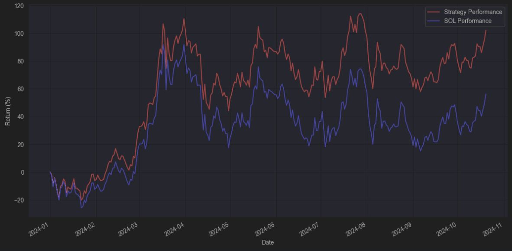

# 🟣 SOL Super Staking - \[Deprecated]


**⚠️ Deprecated vault — historical reference only.**

This vault has been deprecated and is no longer active on Neutral Trade. It is not accepting deposits and is not part of the current product line-up. Do not present this strategy as available or current. For live vaults and current data, see the active strategies and the API reference at https://www.neutral.trade/api/v1/docs.


## Explanation of the SOL Super Drift Staking

The **SOL Super Drift Staking** stands as a foundational cornerstone for enhancing economic security on Solana and liquidity on Jupiter Perp DEX.&#x20;

We acquire and collateralize dSOL, earning SOL LST yield, then open borrow positions to run delta neutral strategies on top of our dSOL collateral.

## Where does the yield come from?

Let’s explore the key sources of yield for the staking vault:

1. JLP fees —17.59% APY as of 09/12/2025 (75% of trading fees, borrowing fees, mint/burn fees, liquidation fees from traders trading on Jupiter Perp DEX)
2. dSOL staking, earning Solana’s inflation rewards, priority fees, and MEV opportunities  — 7.52% APY as of 09/19/2025
3. Funding fees from Perpetual Shorts on ETH, BTC, and SOL (Longs usually pay shorts perps funding) —  \~7.92% APR, \~11.20% APR, and \~3.02% APR as of 09/19/2025

This strategy allows you to maintain Solana exposure while earning an impressive \~15.98% APR of real yield on your SOL.

It’s a powerful solution for maximizing yield while staying aligned with Solana’s ecosystem, supporting the economic security of Solana while providing liquidity to Jupiter and Drift.&#x20;

<figure><figcaption></figcaption></figure>

## What is dSOL?

dSOL (Drift SOL) is a SOL liquid staked token (LST) of the decentralized exchange (DEX) Drift. As a staker, you earn yield from multiple sources: Solana’s inflation rewards, priority fees, and MEV opportunities.

If you’re familiar with JitoSOL, think of dSOL as its direct counterpart, but designed specifically by Drift DEX.

> More info about what is LST:\
> [https://www.bitcoin.com/get-started/what-is-a-liquid-staking-token/](https://www.bitcoin.com/get-started/what-is-a-liquid-staking-token/)

<figure><figcaption></figcaption></figure>

At the time of writing, the APY for dSOL sits at a competitive 7.52% APY as of 09/19/2025.

> [https://app.drift.trade/earn/dsol-liquid-staking](https://app.drift.trade/earn/dsol-liquid-staking)

## Traditional SOL staking options

* JitoSOL yield loop on Kamino (Depeg risks) — 13.05% APY
* Pure staking on JitoSOL, JupSOL, dSOL — \~8% APY
* SOL lending — \~4% APY

The Sol Super Drift Staking sets itself apart from the competition, offering a unique approach to maximizing returns.

## What are the risks compared to the original JLPDN vault?

In addition to the risks outlined in [this](https://neutraltrade.medium.com/risks-of-the-jlp-delta-neutral-strategy-294d0899ece4) article, we want to emphasize that depositors are fully exposed to SOL’s market performance. This means you have the potential to capture both upside gains and downside losses depending on SOL’s price movements.

## Check Trades Here (Drift)


[https://app.drift.trade/?authority=EuSLjg23BrtwYAk1t4TFe5ArYSXCVXLBqrHRBfWQiTeJ](https://app.drift.trade/?authority=EuSLjg23BrtwYAk1t4TFe5ArYSXCVXLBqrHRBfWQiTeJ)


## Deposit Links:

Neutral Trade Website (Main):


[https://www.app.neutral.trade/strategies/solnl](https://www.app.neutral.trade/strategies/solnl)


Drift Website (Backup):


[https://app.drift.trade/vaults/strategy-vaults/EuSLjg23BrtwYAk1t4TFe5ArYSXCVXLBqrHRBfWQiTeJ](https://app.drift.trade/vaults/strategy-vaults/EuSLjg23BrtwYAk1t4TFe5ArYSXCVXLBqrHRBfWQiTeJ)


***

## Risks



***

Sol Super Staking launch date - 21 Oct.
