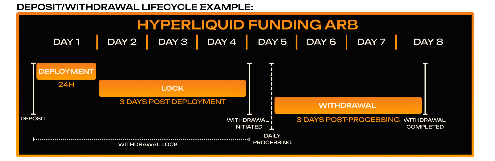

# Fees + Redemption Period

<figure><figcaption></figcaption></figure>

Funds will become available for withdrawal at the conclusion of the redemption period. In Neutral Strategy Vaults, you remain exposed to both the upside and downside during this period.

The annual service fee is time-based. For example, a 2% annual service fee breaks down to about 0.00548% per day (2% / 365 days).

Commission is taken on the profits we’ve made for you. If we didn't make money for you, we don't earn.

Deposited funds are subject to a redemption period to prevent arbitrage opportunities. Due to the nature of our strategies, manual adjustments may be required to facilitate withdrawals in an orderly manner.

**Vault specific details can be found in each vaults "Details" section:**


**Annual Service Fee** — _Time-based usage fee. For example, a 2% annual service fee breaks down to about 0.00548% per day (2% / 365 days)._

**Commission** — _Profit-sharing cut, only charges if profits are made for the user._&#x20;

_**Commission Paid**_ — the total commission you’ve paid. These are only charged on profits above your High Water Mark (the highest balance after fees).

**Earnings** — The total profit you’ve made in the vault, after all fees (commission/service fee) have been deducted.

**Balance** — The current value of your holdings in the vault (after fees).

**High Water Mark** — Your highest post-fee portfolio value. Commission is only charged if your balance goes above this level. New High Water Mark = max(Previous High Water Mark, Current Balance after Fees).&#x20;

**Example:**

1\. You deposit 100 USDC.

2\. Portfolio grows to 110 USDC. A 10% gain is achieved, fees are taken (e.g. 2 USDC if fee = 20%), leaving you with 108 USDC.

3\. Your new High Water Mark = 108 USDC.

4\. You won’t pay fees again unless your portfolio grows beyond 108 USDC.


## Deposit/Withdrawal Lifecycle (Neutral Strategy Vaults)

<figure><figcaption></figcaption></figure>
