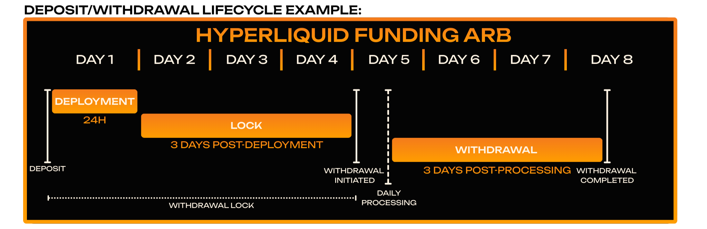

# Fees + Redemption Period

All 12 current Neutral Strategy Vaults have a **1% annual management fee** as their base schedule. The management fee accrues over elapsed time and is charged in vault shares.

At a simple annualized rate, 1% is approximately 0.00274% per day. Actual charges use the program's elapsed-time calculation and current user-specific fee setting rather than a rounded daily rate.

A disclosed promotion, [VIP discount](../getting-started/neutral-vip-program.md), or wallet-level fee setting can reduce the management fee actually charged. It does not change the vault's 1% base schedule.

The production VIP Program currently applies to Neutral Autopilot. Its Silver, Gold, and Diamond tiers reduce the standard 1% annual management fee to 0.90%, 0.80%, and 0.70%, respectively. Performance fees are not discounted.

## Builder fee split

The [Builders Code Rebate](../for-distribution-partners/neutral-builders-code.md) shares part of the management fee with an attributed builder:

* The user-specific management fee is calculated first.
* The builder receives its live per-vault tier percentage of that charged fee.
* The split comes from the manager's fee and does not increase the user's cost.
* Performance fees are excluded from the launched builder ladder.

## Performance fee

Some vaults also charge a **performance fee**, shown as Commission in parts of the app. It applies only to profit above the user's high-water mark and varies by vault.

If a position has not made a new post-fee profit above its high-water mark, no performance fee is charged for that interval.

The high-water mark is the user's highest post-fee position value used for performance-fee accounting. A new deposit can adjust the account's weighted entry basis according to the vault program rules.

## Position values

**Balance** is the current value of the user's vault shares after charged fees.

**Earnings** is the user's profit shown after management and performance fees.

**Commission paid** is the cumulative performance fee charged on profit above the high-water mark.

## Withdrawals

Deposits and withdrawals are processed on each vault's configured schedule. A withdrawal request can have a cooldown followed by a keeper processing window.

The user remains exposed to changes in the vault's price per share until settlement. The value shown when a withdrawal or builder claim is requested is therefore an estimate rather than a fixed redemption amount.

Each vault's Details view contains its current minimums, lock or cooldown, processing cadence, management fee, and performance fee.

<figure><figcaption></figcaption></figure>
