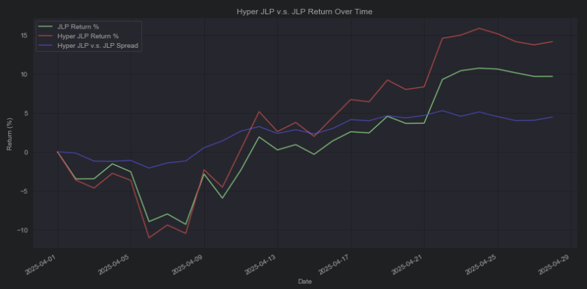

# 💥 Hyper JLP - \[Deprecated]


**⚠️ Deprecated vault — historical reference only.**

This vault has been deprecated and is no longer active on Neutral Trade. It is not accepting deposits and is not part of the current product line-up. Do not present this strategy as available or current. For live vaults and current data, see the active strategies and the API reference at https://www.neutral.trade/api/v1/docs.


## Strategy Description

Holding $JLP but not a fan of ETH, SOL (non-LST), wBTC, idle stablecoins, or Trader PnL? We’ve got something special just for you.

**Meet Hyper JLP!**

A yielding index based on JLP, but reimagined from the ground up.

<figure><figcaption></figcaption></figure>

## Strategy Design

Hyper JLP is a basket of top-performing assets. Designed as a yield-bearing product, Hyper JLP provides exposure to top cap tokens while earning yield on top.

### Index Holdings:

* **HYPE**: Top-performing asset in a fast-growing ecosystem.
* **cbBTC**: BTC exposure with reduced counterparty risk via cbBTC.
* **dSOL**: Yield-bearing SOL LST.
* **JLP DN:** Delta-neutral strategy earning trading, liquidation, and borrowing fees.

### Yield Sources:

* Lending
* Staking
* Delta-neutral strategy

### Full Upside In Bull Markets

• **No trader PnL drag**

**Hyper JLP** has no trader PnL exposure. This means in a rising market, you capture the full upside of the underlying tokens without subsidizing traders' gains.

<figure><figcaption></figcaption></figure>

## Deposit Link:


[https://www.app.neutral.trade/strategies/hyperjlp](https://www.app.neutral.trade/strategies/hyperjlp)


### Check Trades (Drift):


[https://app.drift.trade/?authority=A1B9MVput3r1jS91iu8ckdDiMSugXbQeEtvJEQsUHsPi](https://app.drift.trade/?authority=A1B9MVput3r1jS91iu8ckdDiMSugXbQeEtvJEQsUHsPi)


***

Hyper JLP launch date — 3rd May 2025
