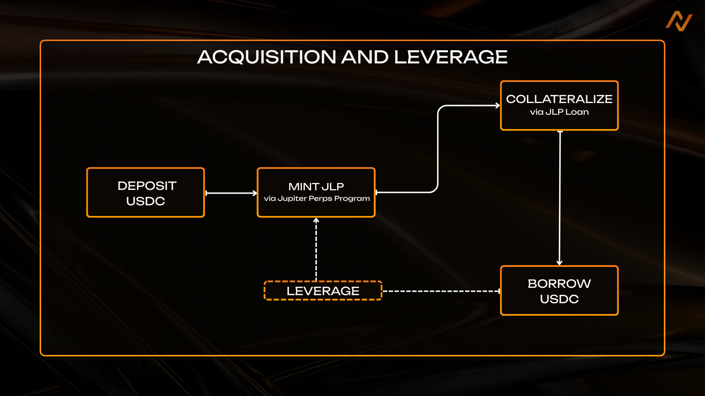
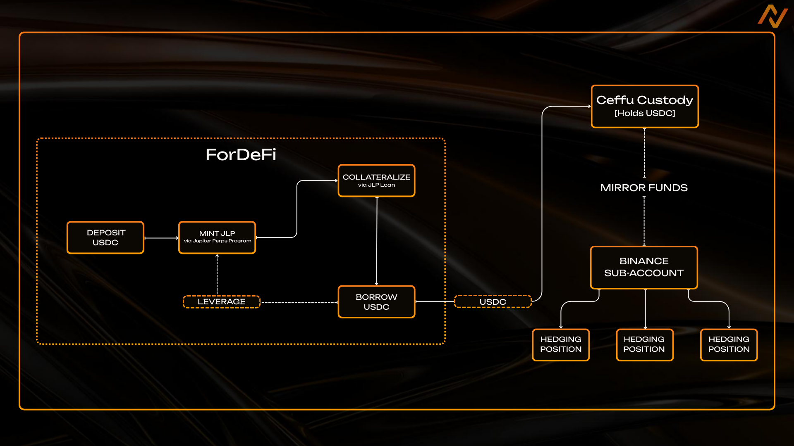
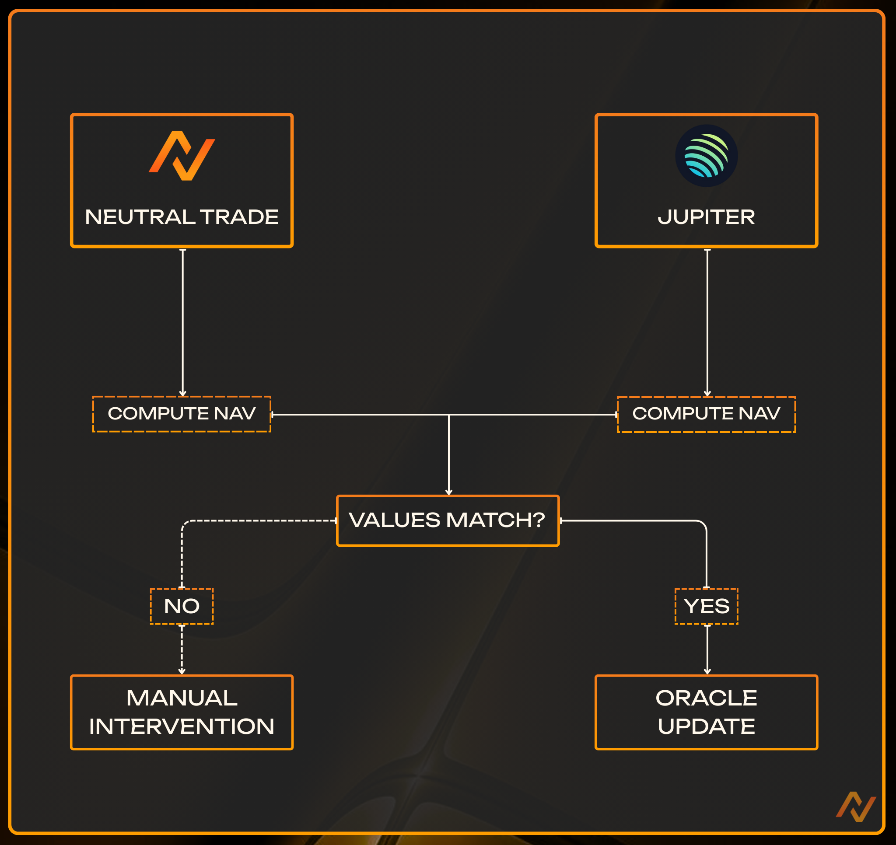

# Jupiter JLP Delta Neutral

## **Overview**

The Jupiter JLP Delta Neutral (JLP-DN) vault. Earn the top stablecoin-denominated delta-neutral yield, powered by Jupiter and its traders.

Jupiter’s JLP liquidity provider token is the foundation of Jupiter's JLP Delta Neutral (JLP-DN) strategy, transforming JLP into a powerful delta-neutral yield product.

Managed by Neutral Trade, the strategy systematically neutralizes the directional exposures of JLP (underlying volatile assets & trader PnL) while preserving and amplifying its underlying yield sources through prudent leverage with institutional-grade risk management.

### **Goal**

* **Permit** liquidity provision to JLP without taking market exposure
* **Provide** stable sustainable USDC yield, powered by JLP + delta-neutral hedging
* **Protect** through institutional custody and operational safeguards

### **Fees**

* **Performance Fee:** 25%
* **Withdrawal Fee:** 0.3% (provided to existing depositors)

### **Redemptions**

**Withdrawal:** 3 - 4 Days

## **Strategy Design (Permit)**

### **Acquiring and Leveraging JLP**

1. **JLP Acquisition**
   * Mint / Burn via Jupiter Perps Program
2. **JLP Collateralization & USDC Borrowing**
   * Deposited as collateral in Jupiter [JLP Loan](https://jup.ag/perps/jlp-loans).
   * USDC is borrowed against the collateral.
3. **JLP Looping**
   * Additional JLP is purchased with the borrowed USDC.
   * The process repeats, targeting a **65% LTV target**.
     1. **Effective Leverage**
        1. The resulting structure achieves approximately **1.9× exposure**, optimizing yield while maintaining safe liquidation buffers.

<figure><figcaption></figcaption></figure>

### **Delta Neutral Hedging**

JLP holds exposure to its **underlying volatile assets** **(SOL, BTC, and ETH)** & **Trader PnL.** JLP DN systematically neutralizes these directional exposures.

#### **JLP DN Automated Hedging Engine**

1. Borrowed USDC is sent to Ceffu custody.
2. USDC balance is mirrored to Binance.
3. JLP directional exposures are monitored (SOL, BTC & ETH, Trader PnL)
4. Perpetual futures short positions are opened to hedge these exposures.
5. Weights adjusts dynamically based on:
   * JLP composition
   * JLP collateral value
   * Market conditions
6. Targets **net-zero delta** across all three tokens.

<figure><figcaption></figcaption></figure>

## **Yield (Provide)**

JLP Delta Neutral is designed to provide delta-neutral and predictable yield relative to traditional JLP. Yield is generated from:

### **JLP Native Yield**

1. Opening/closing fees.
2. Price impact.
3. Trading fees.
4. Borrowing fees.

JLP earns 75% of the fees generated from these components.

### **Leverage Amplification**

* JLP looping **increasing effective yield**.

### **Funding Rates**

* Depending on market conditions, hedging position funding rates can amplify yield. This can also be a cost.

## Insititional-Grade Security

Jupiter JLP DN operates exclusively under an institutional-grade model within a walled garden framework with multi-party policies, role-based approvals, and no single key or entity able to move funds.

#### NT Vault

* JLP is held within a NT Vault with strict transaction policies - No single team member or entity can move funds without multiple approvals&#x20;
* Withdrawal addresses are _strictly whitelisted within the NT Vault Infrastructure._
* Token list is restricted, preventing low-liquidity manipulation - only interactions with Jupiter Perps Program are permitted.&#x20;
* Admin Quorum prevents single-member policy changes

<figure><figcaption></figcaption></figure>

<figure><figcaption></figcaption></figure>

#### **Ceffu Custody/Settlement**

* Borrowed USDC is routed to **Ceffu**, an institutional custody & settlement network.
* These assets remain **isolated and in MPC (Multi-Party Computation) custody**.

**Mirrored Binance Sub-Account**

* The equivalent USDC balance is reflected on a Binance sub-account.
* The sub-account is **co-managed by Jupiter and Neutral Trade**.

**Daily PnL Settlement**

* Unrealized PnL of hedging positions are settled **daily** between Binance and Ceffu.
* Settlement ensures:
  * Hedging collateralization remains safe
  * No counterparty exposure accumulates
  * Primary collateral **never leaves custody**

This framework isolates trading risk and mitigates exchange counterparty exposure.

### **Address & Token Whitelisting**

* Only pre-approved smart contracts & addresses can receive/withdraw funds
* Only specific tokens are permitted ($JLP - $USDC)
* Prevents unauthorized token movements and pump-and-dump vectors

### **NAV (Net Asset Value) & Oracle Verification**

To ensure fair pricing:

1. Neutral Trade independently computes NAV
2. Jupiter independently computes NAV
3. **Both teams match values daily**
4. Oracle update is only pushed after validation
5. Any discrepancy triggers **manual verification**

<figure><figcaption></figcaption></figure>

### **Vaults Audits**

Audits by **Quantstamp, Halborn, and Offside Labs** confirm:

* Correctness of financial logic
* Integrity of share accounting
* Robust access controls
* Safe deposit/withdraw flows

This provides the institutional-grade foundation that makes the JLP Delta Neutral vault secure, predictable, and transparent.

## **Risk Analysis**

Even with heavy mitigation, all financial products carry risk.

### **Key Risk Domains:**

#### **JLP Token Risk**

Exposure to JLP mechanics, including trading activity, margining, and token price behaviour.

JLP’s peg may fluctuate relative to its underlying tokens in fast markets (market price vs. virtual price). There is also a threshold for being fully delta-neutral, since rebalancing hurts yields.

#### **Exchange Liquidity & Settlement Risks**

Although minimized via Ceffu, Binance perpetual contracts carry:

* Liquidity risk
* Market dislocation risk
* Settlement behaviour (e.g., ADL)

#### **Operational Risks**

Mainly relating to:

* Off-chain delta calculations
* Transfers between Ceffu and the on-chain Fordefi vault
* Daily PnL settlement mechanics

### **Liquidation Protection**

#### **Track Record**

* Over **16 months** running the same strategy fully on-chain on Drift. Returned 31.81% since 6/11/2024.
* Zero liquidation events
* Survived major volatility regimes:
  * Trump token launch volatility
  * Trump tariff announcement shock
  * October 10th Black Swan event
  * Multiple SOL/BTC/ETH volatility spikes

Margin buffers are designed to absorb extreme conditions.

#### **Why Liquidation Risk is Low**

The structure benefits from a critical property:

* If short hedges rise in value, the underlying JLP also rises.

Thus collateral value grows in tandem with hedge losses, allowing us to:

* Send more USDC to Ceffu
* Strengthen collateral
* Maintain safe LTV
