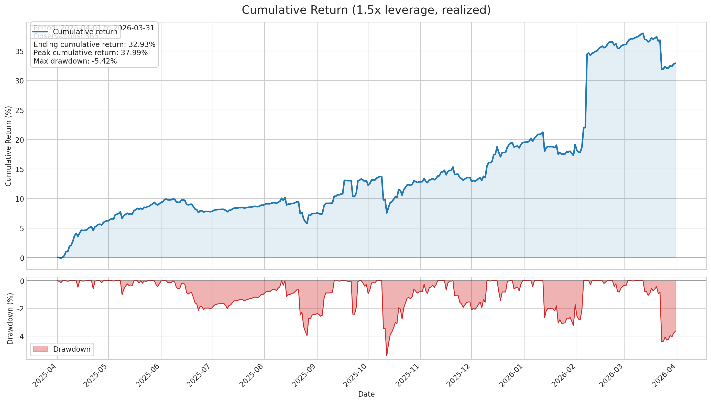

# Mid-frequency Market Making

## Overview 

This is a mid-frequency market-making strategy designed to generate steady returns by providing liquidity to Binance Perpetual Futures markets. It continuously adjusts its quote pricing and activity based on current conditions. The excess return stems from both the predictive power of a proprietary fair price model, as well as high-quality trade execution capability. When risk increases, it scales back to protect capital.&#x20;

<table data-view="cards"><thead><tr><th></th><th data-hidden data-card-target data-type="content-ref"></th></tr></thead><tbody><tr><td><strong>DEPOSIT</strong></td><td><a href="https://www.neutral.trade/strategies/adverseguard-alpha">https://www.neutral.trade/strategies/adverseguard-alpha</a></td></tr></tbody></table>

_Live since April 23, 2026_

## How it works  

**Spread capture** — The system continuously quotes both sides of the ETHUSDT perpetual futures order book on Binance. By maintaining active bid and ask quotes, it earns the spread between buy and sell prices and collects maker rebates.

**Fair price model** — At the core of the strategy is a proprietary model that estimates the true fair price of ETHUSDT in real time. By positioning quotes relative to this fair price rather than the midpoint of the current spread, the strategy improves the profitability of each filled trade.

**Adverse selection detection** — A second predictive model monitors for signs of large incoming directional moves and detects adverse selection, the risk of being on the wrong side of a significant price shift. When these signals trigger, quoting activity is automatically scaled back or paused until conditions normalise.

The result is an asymmetric return profile: consistent spread income in stable conditions, with automated pullback when conditions deteriorate.

#### Venues

**Centralized:** Binance

### Yield Sources

* Bid-Ask spreads
* Maker rebate
* Short-term market inefficiencies

<figure><figcaption></figcaption></figure>

## Risk Management

The strategy employs a stop-loss framework designed to catch risk at both the execution and portfolio level.

**Trading System Controls** The first layer operates directly within the trading application. It monitors real-time position exposure and triggers automated stop-loss actions at the strategy level, responding to adverse price moves before losses compound.

**Drawdown Profile** The maximum observed drawdown was -5.42%, recorded on October 10 of last year. The strategy has not breached this level since.

**Dynamic Risk Scaling** Beyond stop-loss controls, the strategy's predictive model continuously monitors for adverse selection and directional risk. When risk conditions elevate, quoting activity is automatically scaled back or paused, prioritizing capital preservation over incremental spread capture.

## Why AdverseGuard Alpha?

AdverseGuard Alpha operates at the intersection of traditional finance and digital assets, deploying a multi-strategy quantitative framework across global markets.&#x20;

Their edge is built on a world-class team with deep roots in high-frequency trading, asset management, and exchange infrastructure. They bring decades of combined institutional experience from industry titans including Tower Research, Citadel, Susquehanna (SIG), Kronos Research, Point72, State Street, RBC, and J.P. Morgan. This institutional pedigree allows them to bridge the gap between legacy financial rigor and the frontiers of digital asset liquidity.


We’ve excluded AdverseGuard Alpha’s full name to mitigate alpha leaking. Neutral Trade has completed thorough due diligence, including real-money testing.


