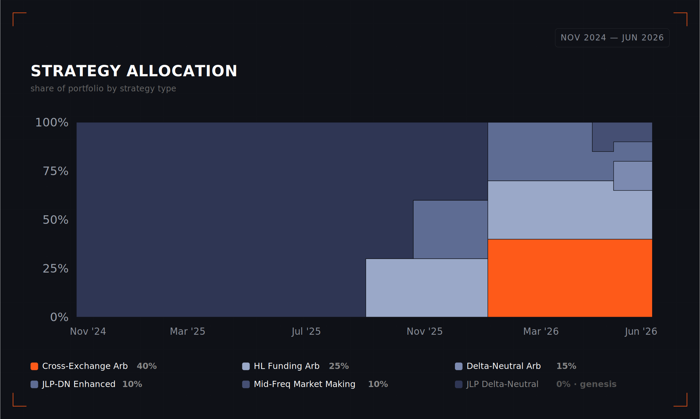

# Neutral Autopilot

One deposit. Neutral Trade's strategies, managed for you.

## Overview

Neutral Trade Autopilot is Neutral Trade's multi-strategy vault, built around a market-neutral core. A single USDC deposit gives you a professionally managed portfolio spanning several of the platform's strategies. It is primarily market-neutral, with up to 5% allocated to directional strategies when the risk-adjusted case is compelling.

Autopilot aims to earn steadily whether crypto is rising or falling.

<table data-view="cards"><thead><tr><th></th><th data-hidden data-card-target data-type="content-ref"></th></tr></thead><tbody><tr><td>DEPOSIT</td><td><a href="https://www.neutral.trade/strategies/nt-master-usdc-bundle">https://www.neutral.trade/strategies/nt-master-usdc-bundle</a></td></tr></tbody></table>

_Live since July 2026_

_New deposits pay no management fee for their first month! A 1% service fee applies after._

## **Why Autopilot?**

Neutral Trade offers a growing set of strategies: funding arbitrage, cross-exchange arbitrage, market making, and more. Each is strong on its own, but choosing and managing them yourself is harder than it looks.

* **Which do you pick?** Every strategy earns differently, so choosing well means learning how each one actually makes money.
* **The lead keeps changing.** The strategy that leads this month may trail the next, so keeping up means watching all of them and moving your capital at the right time.
* **Concentration is a gamble.** Put everything in one strategy and you're exposed to its slow stretches, with no clear signal for when to switch.

For most people, that's more time and attention than it's worth.

**Autopilot removes the guesswork.** A single deposit puts your capital to work across a diversified mix of Neutral Trade's strategies, and the allocation engine manages it from there. It weighs how the strategies behave together, leans toward the strongest risk-adjusted performers, and adds new strategies to its opportunity set as they release. The opportunity set is primarily market-neutral, with up to 5% allocated to directional strategies when the risk-adjusted case is compelling.

<figure><figcaption></figcaption></figure>

What you get:

* **One position, broad exposure.** One position, broad exposure. A diversified, primarily market-neutral portfolio, without choosing a single strategy.
* **Managed for you.** Rebalanced and kept current automatically, with nothing to track, time, or switch.
* **Yield, not direction.** Yield-led. Returns come mainly from structural sources like funding, spreads, and arbitrage, with a small directional sleeve (up to 5%) for added upside when the risk-adjusted case is there. Diversification cushions any single strategy's slow stretches.

**Access, without the overhead.** Reaching these strategies directly has typically meant high minimum deposit requirements and even quarterly redemption periods. Autopilot replaces that with a simple USDC deposit on Solana. The same strategy types, with a much shorter redemption period, made accessible through audited smart contracts. [See Our Thesis for the full picture.](../getting-started/our-thesis.md)

## How it works

<figure><figcaption></figcaption></figure>

1. **Deposit USDC.** You make a single USDC deposit into the Autopilot vault.
2. **Your capital goes to work.** It's spread across a selection of Neutral Trade's live strategies, primarily market-neutral with up to 5% directional, and rebalanced between them as conditions change, so your money keeps working in the strongest performers instead of sitting in one bet.
3. **You earn, hands-free.** Yield from those strategies builds your balance while you do nothing. No strategies to pick, no timing, no rebalancing on your end.
4. **Withdraw when you're ready.** Redeem on the vault's redemption schedule.

Full deposit and withdrawal mechanics are on [How They Work](../neutral-strategy-vaults/how-they-work.md).

## Performance

Between November 2024 and June 2026, Autopilot returned +35.0%, and it did so with very little downside: its deepest fall from a high point was just 2.2%, and annualized volatility was 4.3%. That works out to a Sharpe ratio (return relative to risk) of 4.28.

**Ahead of stocks and crypto, with a fraction of the swings.** Over the same period, the S\&P 500 returned +24% (with a 19% drop along the way), and Bitcoin ended down 19%, having climbed as high as +65% before a 51% peak-to-trough fall. Autopilot compounded steadily through both, which is the point. It doesn't need the market to go up.

<figure><figcaption></figcaption></figure>

**Positive in 19 of its 20 months.** No single month fell more than 1.2%, and the 2.2% above is the deepest high-to-low slide across the whole period, not any one month. That month-to-month consistency is what compounds into the steady overall climb.

<figure><figcaption></figcaption></figure>

## Risk Factors

Autopilot is primarily market-neutral, but it is not risk-free. As a multi-strategy vault, it takes on the risks of the strategies it allocates to. The main ones:

* **Strategy risk.** Each underlying strategy has its own risks, such as funding rates turning negative, forced liquidation or auto-deleveraging on leveraged positions, and adverse selection on market-making trades. Up to 5% of the portfolio may be allocated to directional strategies, which carry market-direction risk and can lose value if the market moves against that position. The 5% cap limits the impact of this sleeve on the vault as a whole. Spreading capital across several strategies, venues, and curators limits the impact of any single strategy, but does not remove these risks.
* **Allocation risk.** The allocation engine leans toward recent risk-adjusted performers, so it can lag a sudden change in market conditions. Allocations are monitored and adjusted continuously.
* **Centralized-exchange counterparty risk.** Some strategies trade on centralized exchanges, which exposes them to venue failure, insolvency, or disruption. Positions there utilize off-exchange custody and settlement.
* **On-chain and smart-contract risk.** Other strategies trade directly on on-chain venues such as Hyperliquid, Jupiter, and Lighter, inheriting the smart-contract, oracle, and protocol risk of those venues. A bug, exploit, or failure at a venue or in the vault's own contracts could cause loss, and this cannot be eliminated entirely.
* **Operational risk.** Execution depends on the continuous availability of trading infrastructure, exchange APIs, and custody integrations. Disruption at any of these can delay rebalancing.

## Trust & Security

Curators cannot withdraw client assets. Every movement is restricted, programmatically, to pre-approved contracts and venues.

On-chain operations run through Fordefi, which includes its MPC workspace, policy engine, admin quorum, and a 12-hour timelock on smart contract changes.&#x20;

Centralized-exchange positions settle off-exchange via Copper (ClearLoop) and Ceffu (MirrorX), reducing exposure to exchange insolvency.

Independent audits: **Offside Labs · Quantstamp · Halborn** reports are public on the [Security](../neutral-strategy-vaults/security.md) page.

**Who runs the strategies.** Neutral Trade's own strategies are managed in-house by a team with Goldman Sachs and top-tier hedge-fund backgrounds. Third-party strategies are run by independent curator teams, each admitted only after Neutral Trade's [Curator Selection](../curators/curator-selection.md) review, which includes a verifiable track record, documented risk and leverage limits, and an operational check; teams with unverifiable records are declined.&#x20;


**On the roadmap  (not live yet)**

Autopilot is planned to become Neutral Trade's first tokenized vault. Your position becomes a transferable, composable token you can hold, move, or use across DeFi while it keeps earning. While it isn't available today, follow the Neutral Trade official [X](https://x.com/TradeNeutral) account to stay informed for when it launches.


> ### Ready to start?
>
> [Autopilot →](https://www.neutral.trade/strategies/nt-master-usdc-bundle)
>
> Fees, minimum deposit, and the redemption schedule for this vault are shown in the app.

_Products referenced are not intended for individuals in the United States, Mainland China, Hong Kong, sanctioned, or other restricted jurisdictions. This page is for informational purposes only and does not constitute an offer, solicitation, or recommendation to buy or sell any financial instrument. Digital-asset strategies involve significant risk, including possible loss of principal. See the_ [_Risk Warnings and Disclaimers Statement_](../legal/risk-warnings-and-disclaimers-statement.md)_._
