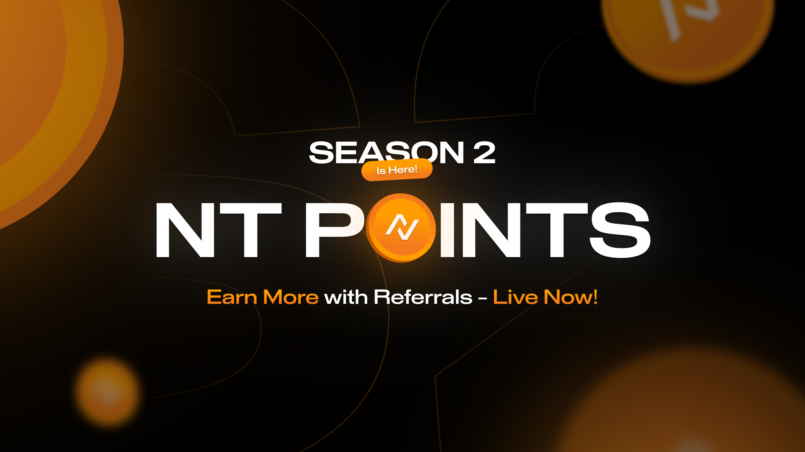

---
layout:
  width: default
  title:
    visible: true
  description:
    visible: true
  tableOfContents:
    visible: true
  outline:
    visible: true
  pagination:
    visible: true
  metadata:
    visible: true
  tags:
    visible: true
  actions:
    visible: true
---

# Neutral Trade Points & Referrals

<figure><figcaption></figcaption></figure>

_Season 2 is the current active rewards period._

## NT Points

**NT Points** track your contribution to the Neutral Trade protocol. The more capital you deposit and the longer you keep it working in Neutral Strategy Vaults, the more points you accumulate.

**The goal of NT Points is simple:**

Align user incentives with protocol growth. Reward those who provide liquidity and support Neutral Trade's sustainable scaling.

NT Points track your cumulative contribution to the protocol. Their future utility has not yet been announced.&#x20;

→ View your points balance: [neutral.trade/points](https://www.neutral.trade/points)

### How You Earn NT Points

There are two ways points accrue, both run simultaneously.

**1. Deposit points (daily)**

Every day you have funds in a Neutral Strategy Vault, you earn points based on your deposit size, adjusted by that vault's multiplier.

Larger deposit × longer duration × higher-multiplier vault = more points.

**2. Fee points (monthly)**

When your vault activity generates fees, you earn an additional allocation of points based on your share of total protocol fees that month. These are calculated at month-end and distributed daily over the following month.

This means active depositors in higher-performing vaults earn points from two sources simultaneously.

## Referrals

When someone joins using your code, they become your **referee**, and you are registered as their **referrer**.

Referrers earn **10% of the NT Points** earned by the users they refer.&#x20;

→ View your referrals: [https://www.neutral.trade/referrals](https://www.neutral.trade/referrals)

### Distribution Schedule

Referral-based NT Points are included in **daily TVL point distributions**:

* Each day, the system snapshots total TVL (including referee deposits).
* Points are distributed alongside all other daily rewards.

### Rules & Validations

* Users **cannot refer themselves**.
* Each user can **apply one** referral code only, once applied, it’s permanent.
* Referral codes can be applied **any time**, even after a user has already deposited.
* Invalid or duplicate codes trigger a simple error notification.
