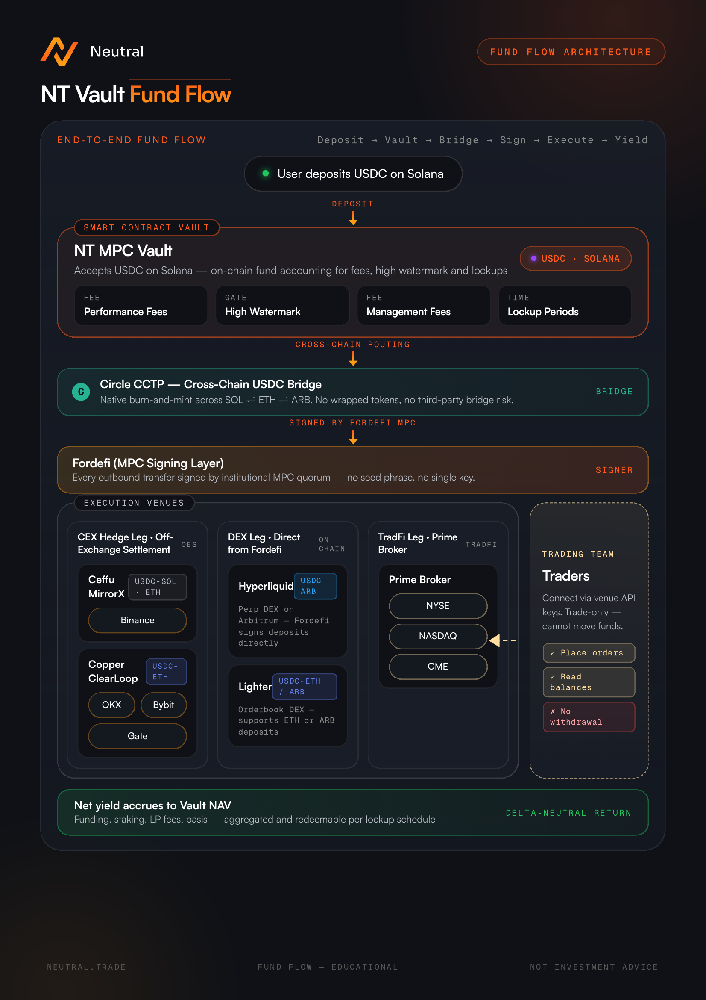

# Copy of Neutral Strategy Vaults

### 1. Key Features

**Hands-Free Execution. Fully Automated Infrastructure**

* Every step is fully automated and optimized. This includes bridging and deploying capital, managing live positions, and executing exits.
* Utilizes institutional-grade signals and real-time monitoring systems to pursue optimal yield and exposure consistently.
* Reduces the need for human input and lets strategies operate around the clock. This enables scalable and cost-effective execution.

**From Solana to Everywhere. Strategies Without Limits**

* Solana acts as users’ single deposit touchpoint - no bridging, no juggling wallets.
* Access highly curated, diverse CeDeFi strategies spanning every major chain and trading venue
* Flexibility to deploy capital where conditions are optimal, tapping into the deepest liquidity for better pricing, lower slippage, and higher yield.

**Institutional-Grade Infrastructure. On-Chain Transparency**

* Assets are held through trusted institutional-grade off-exchange settlement providers, including Copper and CEFFU.
* Transactions, strategy actions, and capital movements are recorded on-chain, ensuring transparency and verifiability.

### 2. System Design

<figure><figcaption></figcaption></figure>

#### 2.1 Core Roles In The System

* **User:** Users deposit into or withdraw from the Neutral Vault. Their data and performance metrics (e.g., high-water mark, shares owned) are recorded and updated on-chain
* **Neutral Vault (NV):** Acts as the central pool, facilitating the flow of capital between users and strategy executors. The Neutral Vault maintains all core operational data, including total shares, pending deposits/withdrawals, deposit cap, and Net Asset Value (NAV)
* **NV Master:** Holds protocol-level authority to whitelist and manage NV managers.
* **NV Manager:** Can create and configure NVs, update strategy parameters (e.g., fee structures), manage keepers and executors, and withdraw accrued management and performance fees.
* **NV Keeper:** Handles routine operations such as batching deposit and withdrawal requests, deploying capital to executors, calculating fees, and updating NAV records.
* **Strategy executors:** Receive funds from the NV and deploy them into trading venues based on real-time trade signals.
* **Automated monitoring system:** Automated Monitoring System: Encodes strategy logic, monitors live trading conditions, generates trade signals, and manages operational flows, including sending instructions to unwind positions, bridging and moving funds between NVs and executors.
* **Protocols and exchanges:** Execution venues where strategies are implemented. CeFi venues are accessed via secure off-exchange settlement providers like Copper and CEFFU.

#### 2.2 Operation Cycle

1. Users initiate deposit or withdrawal requests through the platform interface.
2. NV Keeper temporarily pauses new requests periodically, preparing for batch processing of deposit and withdrawal requests.
3. NV Keeper processes pending deposit and withdrawal requests in batches using the latest Net Asset Value (NAV). Withdrawals are prepared by unwinding positions as needed.
4. Processed deposits are allocated to strategy executors, who then deploy funds across protocols and trading venues based on the NV’s allocation ratio to executors
5. Once processing is complete, the NV Keeper unpauses and reopens the NV for new deposit and withdrawal requests.

#### 2.3 Fee Types

* **Service fees:** Charged based on the elapsed time and the NV’s set service fee rate. These fees are deducted in the form of shares, reducing the user’s share balance. NV managers can withdraw the accumulated service fee shares at any time.
* **Commission:** Charged when the current share price exceeds the user's high-water mark (HWM). The fee is calculated on the profit above the HWM using the predefined performance fee rate. The user’s HWM is then updated to the new share price. Suppose a new deposit is made when the current share price is below the existing HWM. In that case, the HWM is recalculated as a weighted average between the previous HWM (applied to existing shares) and the new deposit’s entry price. Like service fees, commissions are charged in shares and reduce the user’s balance. NV managers may withdraw the accrued commission shares at any time.
* **Deposit fees:** Deducted from the deposited amount before NV shares are issued, resulting in a lower net deposit credited to the user.
* **Withdrawal fees:** Applied to the amount redeemed. The net funds returned to the user are reduced by the applicable withdrawal fee.

### 3. Deposit And Withdrawal

#### 3.1 Deposit And Withdrawal Process

**1. Connect wallet**

* Connect using your preferred Solana-compatible wallet
* We support most major wallets via ReOwn.

**2. Submit deposit request**

* Users can request to deposit into a NV
* All requests are typically processed within 24 hours
* Deposits must meet the minimum required amount
* Requests may be rejected if the NV’s TVL cap has been reached
* Once a deposit request is submitted, users cannot submit another deposit or withdrawal request until the current request is processed. Deposit requests cannot be cancelled after submission

**3. Deposit processing and share issuance**

* Deposits (net of any applicable deposit fees) are processed in batches.
* Funds are deployed into the strategy once processing is complete
* Users receive NV shares that represent their proportional ownership of the NV’s assets

**4. Post-deposit**

* Share price changes based on the performance of the underlying strategy
* A lockup period may apply before withdrawals can be requested
* Service fees and commissions (if applicable) are periodically charged.

**5. Submit withdrawal request**

* Users can request to withdraw their share of the NV’s assets
* Requests may be subject to a cooldown period, which can vary depending on the strategy
* During this cooldown period, the NV manager prepares the necessary assets by unwinding positions as needed
* Once a withdrawal request is submitted, users cannot submit another deposit or withdrawal request until the current request is processed. Withdrawal requests cannot be cancelled after submission

**6. Withdrawal processing and share redemption**

* After the cooldown period, users automatically receive their share of the NV assets (net of any applicable withdrawal fees, service fees, and commissions)
* NV shares are burned once withdrawal process is complete, reflecting the reduction in total ownership
* Withdrawals are typically processed automatically and sent to your wallet within 24 hours after the cooldown period has ended
